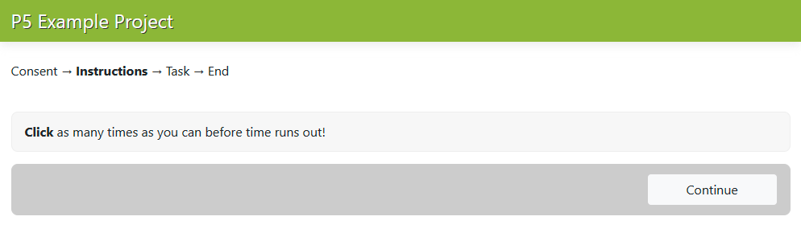
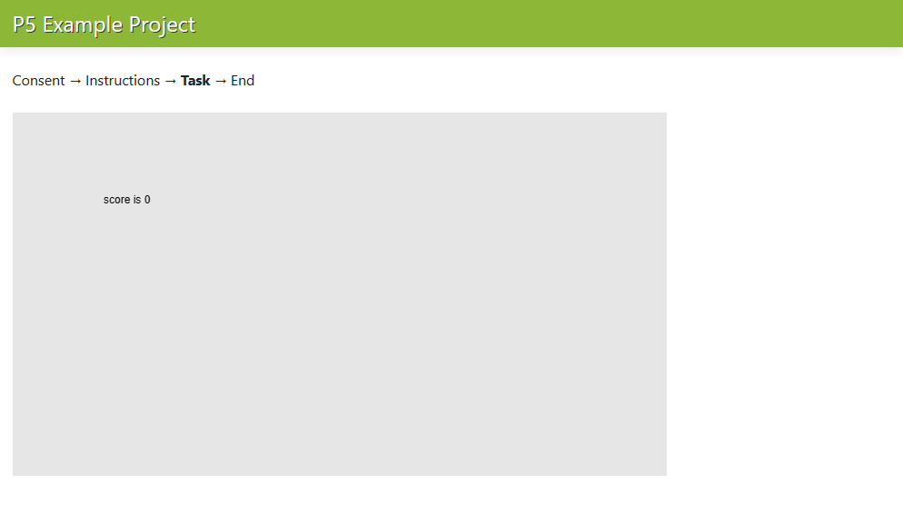

Integrating a JavaScript Task
=============================
The next step up in terms of project complexity from the project demonstrated in the :doc:`quickstart guide <quickstart>`
is to integrate a simple JavaScipt task within your study. This requires the use of a :doc:`blueprint <../advanced/advanced_custom_pages>`
(which further involve Jinja 2 templating and static files) and a custom database :doc:`table <../advanced/database_tables>`.

This guide will walk you through the steps of doing this. First, let's create a new project directory called `p5_example`
and populate that directory with several subdirectories.

The source code is available `on GitHub <https://github.com/colbyj/bride-of-frankensystem-examples/tree/master/p5_example>`_.

Getting Ready
-------------

.. table:: The directories required by the project.
    :widths: 34,50

    ============================================  ============
    Directory                                     Description
    ============================================  ============
    /p5_example/my_task/                          The root directory for the blueprint.
    /p5_example/my_task/static/                   The static folder for the blueprint. Where we will place any static project files (such as ``.js`` files).
    /p5_example/my_task/tables/                   The directory where we will put the definition for the custom database table (the ``.json`` file).
    /p5_example/my_task/templates/                The directory where we will put any template files (the ``.html`` files).
    /p5_example/my_task/templates/instructions/   An optional directory where we will place an instruction page (as a ``.html`` file).
    /p5_example/my_task/templates/simple/         The directory where we will put the HTML code for our task (as a ``.html`` file).
    ============================================  ============

In the screenshot below, you can see the complete listing of files your project will have at the end of the guide.

  The files you will have in those directories at the end of the guide.

Python Code (``views.py``)
--------------------------
For more complex integrations you will need to write Python code inside of a ``views.py`` file, see :doc:`../advanced/advanced_custom_pages`.
For this example you do not! We will use the features built into BOFS to handle the required logic.

The Task (``my_task.js``)
-------------------------
The following JavaScript task is written using the P5 JavaScript library. A copy of the minified P5 library itself is
in the ``/p5_example/my_task/static/p5.min.js`` file (which you can find on the internet yourself).

.. code-block:: javascript
    :caption: /p5_example/my_task/static/my_task.js

    let score = 0;

    function setup() {
        createCanvas(720, 400);
    }

    function draw() {
        background(230);
        text('score is ' + score, 100, 100);
    }

    function mousePressed() {
        score += 1;
    }

    // Send our score after 5000 seconds
    setTimeout(function () {
        let dataToSend = {
            score: score
        };

        $.post("/table/my_task", dataToSend, function () {
            window.location.href = "/redirect_next_page"
        });
    }, 5000);

This guide will not explain how this code was written, but only point out two things. First, there is a ``score``
variable that increases when the canvas is clicked. Second, there is a ``setTimeout()`` call that performs a POST
request of the ``score`` variable a specific BOFS route after 5 seconds, and then redirects the user.

The redirection URL (``/redirect_next_page``) is a special one that is build into BOFS. It figures out which page the
user is currently on and then redirects them to the next page defined in ``PAGE_LIST`` (which is defined in your
project's configuration ``.toml``).

The URL specified for the POST request (``/table/my_task``) is for a built in route, but it requires that a table be
defined as a ``.json`` file and placed in ``/p5_example/my_task/tables/``.

The Table (``my_task.json``)
----------------------------
The database table is defined by following a specific ``.JSON`` specification, as described in :doc:`../advanced/database_tables`.

.. code-block:: json
    :caption: /p5_example/my_task/tables/my_task.json

    {
      "columns": {
        "score": {
          "type": "integer",
          "default": 0
        }
      },
      "exports": [
        {
          "fields": {
            "average_score": "avg(score)",
            "high_score": "max(score)"
          }
        }
      ]
    }

This file defines one column, "score", as an integer with a default value of ``0``. It also defines two exports:
``average_score``, which calculates the average of a user's scores via the SQL ``avg`` function, and ``high_score``, which
calculates the maximum value of the user's scores via the SQL ``max`` function. (As it'll turn out, a user will only ever
submit one score, so the average and max yield boring results.)

Including this file in your project will add a new table called ``my_task`` to your database.

  A listing of the database tables now included in the project.

The View (``my_task.html``)
---------------------------
The last piece of the task is the HTML file to display the P5 JavaScript app.

.. code-block:: html
    :caption: /p5_example/my_task/templates/simple/my_task.html

    
    
    <main></main>

The JavaScript code does most of the work here, and all that is needed is the ``<main>`` tag, so that P5 knows where to
put the canvas. Note that this HTML will get utilized within the main project template so that the usual survey header
in green and all of the styling get applied as if it's any other page.

Placing a html file under the ``templates/simple/`` directory allows it to be accessible via the ``/simple/<fileName>``
route, which we will make use of in the configuration later on. In this case, it will be available at the
``/simple/my_task`` URL.

The Instruction Page (``task_instructions.html``)
-------------------------------------------------
There are two more small pieces to the project to add before testing. The first is an instruction page.

.. code-block:: html
    :caption: /p5_example/my_task/templates/instructions/task_instructions.html

    <b>Click</b> as many times as you can before time runs out!

This will be available via the ``/instructions/task_instructions`` URL.

The Consent Text (``consent.html``)
-----------------------------------
And the last thing is the consent page.

.. code-block:: html
    :caption: /p5_example/consent.html

    Your consent html can go here.

The Configuration File (``p5_example.toml``)
--------------------------------------------
Let's now hook up all of these pieces together and get the example working. The important part here is to add the
correct URLs to ``PAGE_LIST``.

.. code-block:: toml
    :caption: /p5_example/p5_example.toml

    # Database settings
    SQLALCHEMY_DATABASE_URI = 'sqlite:///p5_example.db'

    # The secret key MUST be changed to something unique.
    # You should at the very least mash your keyboard a bit to generate a random string.
    SECRET_KEY = 'You Must Change This to Something Unique'

    # --------------------
    # Application Settings
    # --------------------
    APPLICATION_ROOT = ''          # Rarely adjusted, used to set the project to be accessible at a different URL rather than /.
    TITLE = 'P5 Example Project'   # What users see at the top of the page
    ADMIN_PASSWORD = 'example'     # Used to log in to the admin pages at /admin
    USE_BREADCRUMBS = true        # Show breadcrumbs-style progress bar
    PORT = 5002                    # Configure what port the project will be accessible at
    RETRIEVE_SESSIONS = true       # If ID entered at /external_id was already used, then attempt to load a participant's progress from the database and redirect them to where they last were.
    ALLOW_RETAKES = true           # With the external_id page in use, setting this to true will prevent the same ID from being used twice.
    LOG_GRID_CLICKS = false        # Used for more fine-grained logging of participant's progress through questionnaires. Log the time the each radio button in a radio grid is clicked.
    CONDITIONS = []                # Leave blank for only 1 condition. Format for multiple conditions is shown below
    #CONDITIONS = [{label='condition 1', enabled=true}, {label='condition 2', enabled=true}]

    # External ID Settings, adjust these to adjust the phrasing on /external_id for Prolific, MTurk, etc.
    EXTERNAL_ID_LABEL = "Mechanical Turk Worker ID"
    EXTERNAL_ID_PROMPT = "Please enter your MTurk Worker ID. You can find this on your MTurk dashboard."

    # ------------------------------
    # Completion Codes and end route
    # ------------------------------
    #STATIC_COMPLETION_CODE = ''        # Set this if you want all participants to be given the same completion code at the end of the survey.
    GENERATE_COMPLETION_CODE = true     # Generate a random completion code for the user.
    COMPLETION_CODE_MESSAGE = 'Please copy and paste this code into the MTurk form:'
    # OUTGOING_URL = ''                 # On the /end route, participants can be optionally redirected to an external page instead of being given a code

    # ---------
    # Page List
    # ---------
    # Defines the pages that the user will see and their order.
    # Each entry must contain a user-friendly name that is displayed to the user and a unique path.
    # For questionnaires, you can append a /<tag> to the end if you need to include the same questionanire twice.
    # If USE_BREADCRUMBS is true, then the pages with identical names will have (#) beside them.
    PAGE_LIST = [
        {name='Consent', path='consent'},
        {name='Instructions', path='instructions/task_instructions'},
        {name='Task', path='simple/my_task'},
        {name='End', path='end'}
    ]

Walkthrough Screenshots
-----------------------
That's it! Let's look at what we just created.

