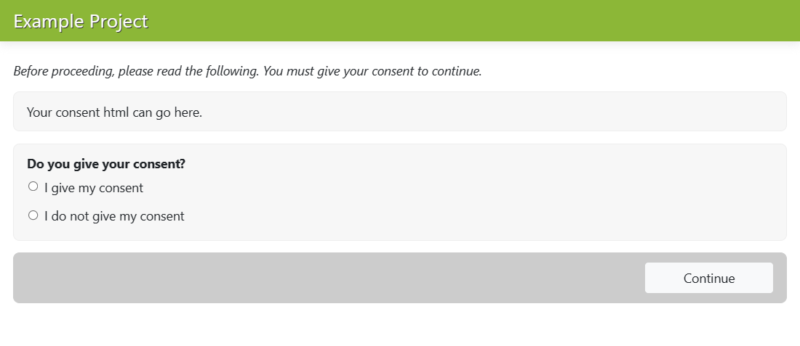
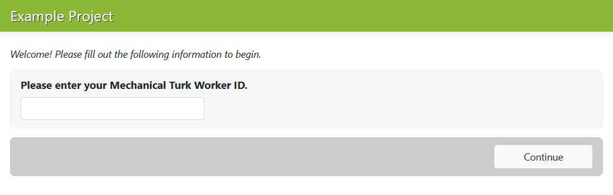
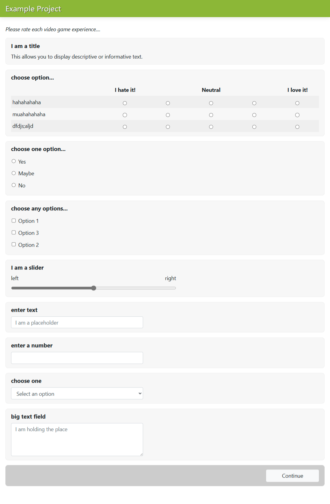
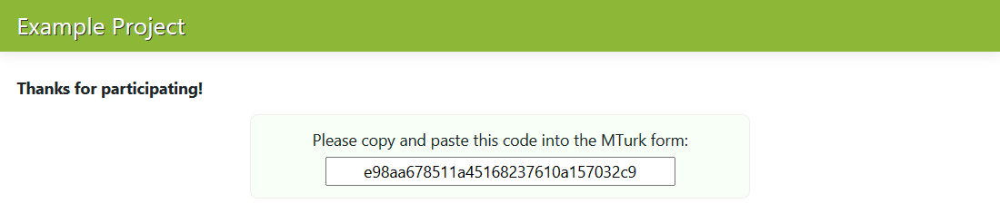
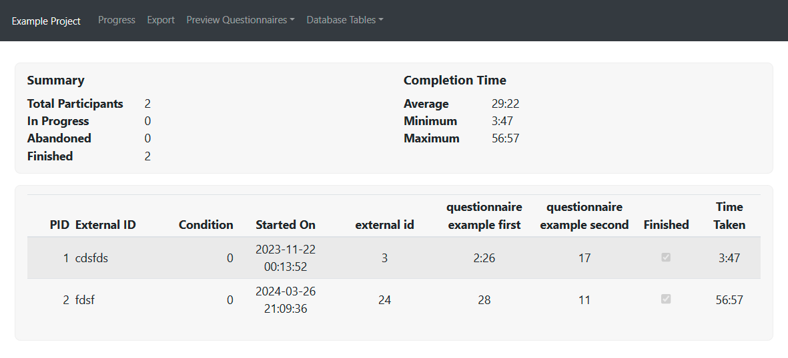

Quickstart Guide (The Minimal Example)
======================================

To get started using Bride of Frankensystem (BOFS), the first thing you need to do is ensure that it is installed
on your computer. Please follow the instructions on :doc:`installation` and then come back to this page to continue the
quickstart guide.

In this guide, we will go over a simple example project to demonstrate how to get started with a BOFS project and to
demonstrate some of the features of BOFS.

The minimal example only demonstrates some of the features of BOFS, but it is a good starting point for new projects.
To follow the quickstart, download the example code from `here <https://github.com/colbyj/bride-of-frankensystem-examples/archive/refs/heads/master.zip>`_.
You can also preview the code on `on GitHub <https://github.com/colbyj/bride-of-frankensystem-examples/tree/master/minimal_example>`_.

The Files
---------

The minimal example consists of only 4 files:

============================================  ============
File                                          Description
============================================  ============
/minimal_example/questionnaires/example.json  An example questionnaire file demonstrating all of the question types available.
/minimal_example/consent.html                 A HTML file that defines how the consent form should look.
/minimal_example/minimal.toml                 A configuration file that defines many important aspects of the minimal example.
============================================  ============

Let's go through each file to understand what each is doing.

.. literalinclude:: questionnaires/example.json
    :caption: example.json
    :language: JSON

This file describes a questionnaire that will be used within the study.
This is the same example questionnaire as is shown on :doc:`questionnaires/main`. It includes 9 different question
types:

* A text view
* A radio grid
* A radio list
* A check list
* A slider
* A text entry field
* A number entry field
* A drop down menu
* A multi-line text entry field

.. literalinclude:: quickstart/minimal/consent.html
    :caption: consent.html
    :language: html

This file demonstrates how consent text is defined within a project.

.. literalinclude:: quickstart/minimal/minimal.toml
    :caption: minimal.toml
    :language: toml

This file is the configuration of the study. It is where all of the important aspects of the study are defined. This
quickstart only covers some of the options -- for a complete description of every option, see :doc:`configuration`.

Let's go over some of the variables in the configuration:

* ``SQLALCHEMY_DATABASE_URI`` defines the filename of the database. The database gets created when the project is run.
* ``SECRET_KEY`` is a string that should be unique to each project. It is used to secure the session cookies.
* ``TITLE`` defines what shows up on the web browser's tab as well as the text at the top of each page in the survey.
* ``ADMIN_PASSWORD`` defines the password to access the admin panel at ``/admin``
* ``PORT`` defines the port that the survey will be accessible at once it is running (e.g., ``http://<your ip address>:5001``) if the port is ``5001``.
* ``PAGE_LIST`` defines the pages that will be included within the survey as well as the order in which they appear.

The page list is the most important variable for determining the behavior of your survey. It is a list of pages where
each page is defined as a dictionary with two keys (``name`` and ``path``). For example, with
``{name='Consent', path='consent'}`` as the first page in the list, the first page that a user will see is the consent
page (at ``/consent``), where they are shown the consent form (as defined in ``consent.html``). After this page, the
next page they see is the ``/external_id`` page, which in this case asks the user for their Amazon Mechanical Turk ID
(if you were looking through the configuration file, you'll have seen that this is something you can configure).

In general, pages are given a ``name``, which is what shows up on the title of the page (i.e., the name shown in the
tab on the web browser), and a ``path``, which is the url that the user will be taken to (without the preceding ``/``).

There are many paths built into BOFS, for display things like consent forms, instruction pages, and questionnaires. See
:doc:`routing/default_routes` for a list of valid, built-in routes. For a more general overview of routing, see :doc:`routing/main`.

Running the Example
-------------------

Let's now run the example by opening up the command line/terminal and executing ``BOFS minimal.toml``. You should see
several messages show up.

.. code-block:: text

    Loading blueprint: BOFS.admin
    BOFS.admin: `models.py` not found. Add a `models.py` file to your blueprint folder use this feature.
    Loading blueprint: BOFS.default
    BOFS.default: Loaded <class 'BOFS.default.models.create.<locals>.Participant'>
    BOFS.default: Loaded <class 'BOFS.default.models.create.<locals>.Progress'>
    BOFS.default: Loaded <class 'BOFS.default.models.create.<locals>.RadioGridLog'>
    BOFS.default: Loaded <class 'BOFS.default.models.create.<locals>.Display'>
    BOFS.default: Loaded <class 'BOFS.default.models.create.<locals>.SessionStore'>
    BOFS.default: `models.py` loaded!
    example
    Listening on http://0.0.0.0:5001
    Preview locally at http://127.0.0.1:5001

The last line of output shows you what URL your survey is available at for previewing it on your local machine. Open
that URL in your web browser and let's go through each page.

The first page that shows up is the consent page (``/consent``). Click "Continue" to go to the next page.

The second page is the external ID entry page (``/external_id``). The user gets prompted to enter an external ID and then
needs to press "Continue" to move on to the next page.

The third page is the questionnaire whose JSON code was shown earlier. You can see what each question looks like. To
continue on to the next page, the user needs to provide responses to the questions and then press "Continue".

The fourth page is the same questionnaire being shown a second time.

The fifth page is the end page, where the user is shown a completion code.

The Administration Panel
------------------------

Every BOFS project has a built in administration panel, accessible via the ``/admin`` route. So, for the minimal
example, this will be accessible at ``http://127.0.0.1:5001/admin``. Going to this URL should prompt the user for a
password. This password is defined inside of the configuration file (``minimal.toml`` for this project). For the
example, the password is ``example``.

Entering the password successfully will bring you to the administration panel, which shows participants' progress
through the study, summary statistics relating to completion, and various other pages listed at the top. These include:

* **Progress**, the page you are looking at.
* **Export**, which allows you to export the data collected from the study in a CSV format.
* **Preview Questionnaires**, which gives you the ability to preview questionnaires used in the study, as well as any questionnaires on the file system.
* **Database Tables**, which lets you explore the underlying database and the data you've collected.

Extending the Minimal Example
-----------------------------

Please continue reading to learn about the different ways in which this example project can be extended.

* To learn how to assign participants to different conditions, see :doc:`conditions`.
* To learn more about questionnaires, see :doc:`questionnaires/main`.
* To learn more about how to show static content to participants, see :doc:`instruction_pages`.
* To learn about how to add your own custom pages, see :doc:`blueprints`.
* To learn how to store your own data to the database, see :doc:`tables`.
